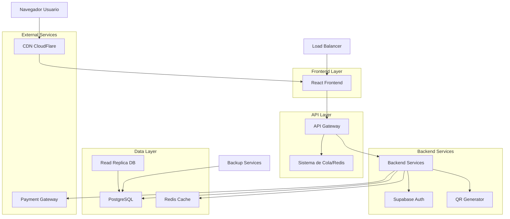
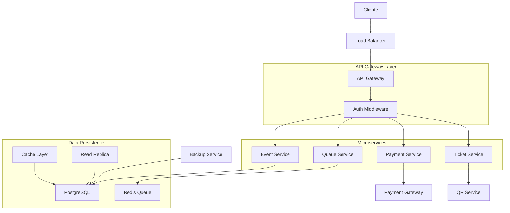
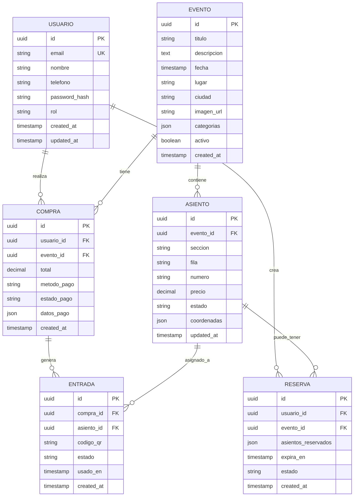

## 1. Diseño de Arquitectura



## 2. Descripción de Tecnologías

- **Frontend**: React@18 + TypeScript + Vite + TailwindCSS
- **Estado Global**: Redux Toolkit + RTK Query
- **Backend**: Node.js@20 + Express + TypeScript
- **Inicialización**: vite-init
- **Base de Datos**: PostgreSQL@15 (Primary + Read Replicas)
- **Cache**: Redis@7 (Session + Event data)
- **Colas**: Bull Queue + Redis
- **Autenticación**: Supabase Auth
- **Almacenamiento**: Supabase Storage (QR codes)
- **Monitoreo**: Prometheus + Grafana
- **Deployment**: Docker + Kubernetes

## 3. Definición de Rutas

| Ruta | Propósito |
|-------|---------|
| / | Página de inicio con búsqueda y eventos destacados |
| /eventos/:id | Detalle del evento con mapa de asientos |
| /sala-espera/:evento | Sistema de cola virtual para alta demanda |
| /seleccion-asientos/:evento | Interfaz de selección de asientos |
| /carrito | Resumen de entradas seleccionadas |
| /checkout | Proceso de pago seguro |
| /mis-entradas | Gestión de entradas compradas con QR |
| /perfil | Información del usuario y preferencias |
| /login | Autenticación de usuarios |
| /register | Registro de nuevos usuarios |
| /organizador/dashboard | Panel de control para organizadores |
| /admin/* | Panel administrativo general |

## 4. Definiciones de API

### 4.1 API de Eventos

```
GET /api/eventos
```

Request Query Parameters:
| Parámetro | Tipo | Requerido | Descripción |
|-----------|-------------|-------------|-------------|
| ciudad | string | false | Filtrar por ciudad |
| categoria | string | false | Filtrar por categoría |
| fecha_desde | date | false | Fecha mínima |
| fecha_hasta | date | false | Fecha máxima |
| pagina | number | false | Número de página |
| limite | number | false | Items por página |

Response:
```json
{
  "eventos": [
    {
      "id": "uuid",
      "titulo": "string",
      "descripcion": "string",
      "fecha": "ISO date",
      "lugar": "string",
      "ciudad": "string",
      "imagen_url": "string",
      "categorias": ["string"],
      "precio_min": "number",
      "precio_max": "number",
      "disponibilidad": "number"
    }
  ],
  "total": "number",
  "pagina": "number"
}
```

### 4.2 API de Sala de Espera

```
POST /api/cola/unirse
```

Request Body:
| Parámetro | Tipo | Requerido | Descripción |
|-----------|-------------|-------------|-------------|
| evento_id | string | true | ID del evento |
| usuario_id | string | true | ID del usuario |

Response:
```json
{
  "posicion": "number",
  "tiempo_estimado": "number",
  "session_id": "string",
  "estado": "esperando|activo|expirado"
}
```

### 4.3 API de Selección de Asientos

```
GET /api/eventos/:id/asientos
```

Response:
```json
{
  "mapa": {
    "secciones": [
      {
        "id": "string",
        "nombre": "string",
        "precio": "number",
        "color": "string",
        "asientos": [
          {
            "id": "string",
            "fila": "string",
            "numero": "string",
            "estado": "disponible|ocupado|reservado",
            "coordenadas": { "x": "number", "y": "number" }
          }
        ]
      }
    ]
  },
  "actualizado_en": "timestamp"
}
```

```
POST /api/asientos/reservar
```

Request Body:
| Parámetro | Tipo | Requerido | Descripción |
|-----------|-------------|-------------|-------------|
| asientos_ids | array | true | IDs de asientos a reservar |
| evento_id | string | true | ID del evento |
| usuario_id | string | true | ID del usuario |

### 4.4 API de Pagos

```
POST /api/pagos/procesar
```

Request Body:
| Parámetro | Tipo | Requerido | Descripción |
|-----------|-------------|-------------|-------------|
| reserva_id | string | true | ID de la reserva |
| metodo_pago | string | true | tarjeta/webpay/transferencia |
| datos_pago | object | true | Datos según método |

## 5. Diagrama de Arquitectura del Servidor



## 6. Modelo de Datos

### 6.1 Definición del Modelo



### 6.2 Lenguaje de Definición de Datos

Tabla de Usuarios (users)
```sql
CREATE TABLE users (
    id UUID PRIMARY KEY DEFAULT gen_random_uuid(),
    email VARCHAR(255) UNIQUE NOT NULL,
    password_hash VARCHAR(255) NOT NULL,
    nombre VARCHAR(100) NOT NULL,
    telefono VARCHAR(20),
    rol VARCHAR(20) DEFAULT 'user' CHECK (rol IN ('user', 'organizer', 'admin')),
    email_verified BOOLEAN DEFAULT false,
    created_at TIMESTAMP WITH TIME ZONE DEFAULT NOW(),
    updated_at TIMESTAMP WITH TIME ZONE DEFAULT NOW()
);

CREATE INDEX idx_users_email ON users(email);
CREATE INDEX idx_users_rol ON users(rol);
```

Tabla de Eventos (events)
```sql
CREATE TABLE events (
    id UUID PRIMARY KEY DEFAULT gen_random_uuid(),
    titulo VARCHAR(255) NOT NULL,
    descripcion TEXT,
    fecha TIMESTAMP WITH TIME ZONE NOT NULL,
    lugar VARCHAR(255) NOT NULL,
    ciudad VARCHAR(100) NOT NULL,
    imagen_url VARCHAR(500),
    categorias JSONB,
    capacidad_total INTEGER NOT NULL,
    activo BOOLEAN DEFAULT true,
    created_at TIMESTAMP WITH TIME ZONE DEFAULT NOW(),
    updated_at TIMESTAMP WITH TIME ZONE DEFAULT NOW()
);

CREATE INDEX idx_events_fecha ON events(fecha);
CREATE INDEX idx_events_ciudad ON events(ciudad);
CREATE INDEX idx_events_activo ON events(activo);
```

Tabla de Asientos (seats)
```sql
CREATE TABLE seats (
    id UUID PRIMARY KEY DEFAULT gen_random_uuid(),
    evento_id UUID REFERENCES events(id) ON DELETE CASCADE,
    seccion VARCHAR(50) NOT NULL,
    fila VARCHAR(10) NOT NULL,
    numero VARCHAR(10) NOT NULL,
    precio DECIMAL(10,2) NOT NULL,
    estado VARCHAR(20) DEFAULT 'available' CHECK (estado IN ('available', 'reserved', 'sold')),
    coordenadas JSONB,
    updated_at TIMESTAMP WITH TIME ZONE DEFAULT NOW(),
    UNIQUE(evento_id, seccion, fila, numero)
);

CREATE INDEX idx_seats_evento ON seats(evento_id);
CREATE INDEX idx_seats_estado ON seats(estado);
CREATE INDEX idx_seats_seccion ON seats(seccion);
```

Tabla de Reservas (reservations)
```sql
CREATE TABLE reservations (
    id UUID PRIMARY KEY DEFAULT gen_random_uuid(),
    usuario_id UUID REFERENCES users(id),
    evento_id UUID REFERENCES events(id),
    asientos_ids UUID[] NOT NULL,
    expira_en TIMESTAMP WITH TIME ZONE NOT NULL,
    estado VARCHAR(20) DEFAULT 'active' CHECK (estado IN ('active', 'expired', 'completed')),
    created_at TIMESTAMP WITH TIME ZONE DEFAULT NOW()
);

CREATE INDEX idx_reservations_usuario ON reservations(usuario_id);
CREATE INDEX idx_reservations_evento ON reservations(evento_id);
CREATE INDEX idx_reservations_expira ON reservations(expira_en);
CREATE INDEX idx_reservations_estado ON reservations(estado);
```

Tabla de Compras (purchases)
```sql
CREATE TABLE purchases (
    id UUID PRIMARY KEY DEFAULT gen_random_uuid(),
    usuario_id UUID REFERENCES users(id),
    evento_id UUID REFERENCES events(id),
    total DECIMAL(10,2) NOT NULL,
    metodo_pago VARCHAR(50) NOT NULL,
    estado_pago VARCHAR(20) DEFAULT 'pending' CHECK (estado_pago IN ('pending', 'completed', 'failed', 'refunded')),
    transaccion_id VARCHAR(255),
    datos_pago JSONB,
    created_at TIMESTAMP WITH TIME ZONE DEFAULT NOW(),
    updated_at TIMESTAMP WITH TIME ZONE DEFAULT NOW()
);

CREATE INDEX idx_purchases_usuario ON purchases(usuario_id);
CREATE INDEX idx_purchases_evento ON purchases(evento_id);
CREATE INDEX idx_purchases_estado ON purchases(estado_pago);
```

Tabla de Entradas (tickets)
```sql
CREATE TABLE tickets (
    id UUID PRIMARY KEY DEFAULT gen_random_uuid(),
    compra_id UUID REFERENCES purchases(id),
    asiento_id UUID REFERENCES seats(id),
    codigo_qr VARCHAR(255) UNIQUE NOT NULL,
    estado VARCHAR(20) DEFAULT 'active' CHECK (estado IN ('active', 'used', 'cancelled')),
    usado_en TIMESTAMP WITH TIME ZONE,
    created_at TIMESTAMP WITH TIME ZONE DEFAULT NOW()
);

CREATE INDEX idx_tickets_compra ON tickets(compra_id);
CREATE INDEX idx_tickets_asiento ON tickets(asiento_id);
CREATE INDEX idx_tickets_codigo ON tickets(codigo_qr);
CREATE INDEX idx_tickets_estado ON tickets(estado);
```

### 6.3 Permisos de Supabase

```sql
-- Permisos básicos para usuarios anónimos
GRANT SELECT ON events TO anon;
GRANT SELECT ON seats TO anon;

-- Permisos completos para usuarios autenticados
GRANT ALL PRIVILEGES ON users TO authenticated;
GRANT ALL PRIVILEGES ON reservations TO authenticated;
GRANT ALL PRIVILEGES ON purchases TO authenticated;
GRANT ALL PRIVILEGES ON tickets TO authenticated;

-- Políticas de seguridad RLS
ALTER TABLE users ENABLE ROW LEVEL SECURITY;
ALTER TABLE reservations ENABLE ROW LEVEL SECURITY;
ALTER TABLE purchases ENABLE ROW LEVEL SECURITY;
ALTER TABLE tickets ENABLE ROW LEVEL SECURITY;
```

## 7. Estrategias de Alta Disponibilidad

### 7.1 Escalabilidad Horizontal
- Auto-scaling de instancias basado en CPU/memory
- Load balancing con health checks cada 5 segundos
- Database read replicas para consultas de lectura
- CDN global para assets estáticos

### 7.2 Gestión de Alta Demanda
- Sala de espera virtual con posición en tiempo real
- Rate limiting por IP/usuario (100 req/min)
- Circuit breakers para servicios externos
- Graceful degradation cuando servicios fallan

### 7.3 Monitoreo y Alertas
- Latency monitoring < 200ms para APIs críticas
- Error rate alerts > 1% en 5 minutos
- Database connection pooling y query monitoring
- Real-time user experience tracking

### 7.4 Backup y Recuperación
- Backups automáticos cada 6 horas
- Point-in-time recovery disponible
- Disaster recovery en región secundaria
- Data replication cross-region