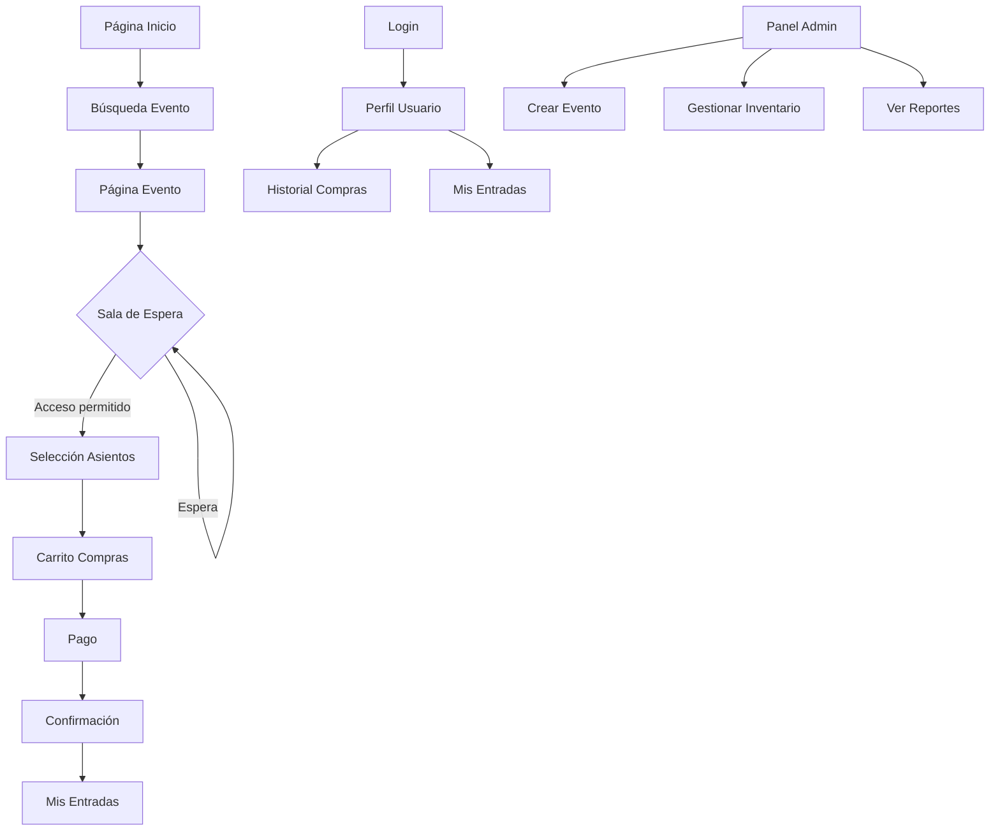

## 1. Descripción del Producto

Plataforma de venta de entradas para eventos en línea con arquitectura altamente escalable y disponible. Diseñada para manejar millones de usuarios simultáneos durante eventos de alta demanda sin interrupciones.

- Resuelve el problema de colapsos del sistema durante ventas masivas
- Permite a usuarios comprar entradas de forma segura y eficiente
- Maximiza la satisfacción del cliente y minimiza pérdidas por caídas del sistema

## 2. Funcionalidades Principales

### 2.1 Roles de Usuario

| Rol | Método de Registro | Permisos Principales |
|------|---------------------|------------------|
| Usuario Común | Email, redes sociales | Buscar eventos, comprar entradas, ver historial |
| Organizador de Eventos | Verificación manual | Crear eventos, gestionar inventario, ver analíticas |
| Administrador | Designado por sistema | Gestión total de plataforma, usuarios y eventos |

### 2.2 Módulos de Funcionalidades

Nuestra plataforma de ticketing consiste en las siguientes páginas principales:

1. **Página de Inicio**: Búsqueda de eventos, eventos destacados, navegación principal
2. **Página de Evento**: Información del evento, mapa de asientos, precios disponibles
3. **Sala de Espera Virtual**: Sistema de cola para acceso ordenado durante alta demanda
4. **Selección de Asientos**: Mapa interactivo, disponibilidad en tiempo real
5. **Carrito de Compras**: Resumen de entradas, tiempos límite, modificaciones
6. **Pago**: Múltiples métodos de pago, seguridad PCI-DSS, confirmación instantánea
7. **Mis Entradas**: Visualización de QR, descarga, transferencia de entradas
8. **Perfil de Usuario**: Datos personales, historial de compras, preferencias

### 2.3 Detalles de Páginas

| Página | Módulo | Descripción de Funcionalidades |
|-----------|-------------|---------------------|
| Inicio | Buscador principal | Filtrar por ciudad, fecha, categoría. Autocompletado inteligente |
| Inicio | Eventos destacados | Carrusel con eventos próximos, cards con imagen y precio |
| Evento | Información general | Título, fecha, lugar, descripción, imágenes del venue |
| Evento | Mapa de asientos | Visualización 3D/secciones, colores por disponibilidad, zoom |
| Sala de Espera | Sistema de cola | Posición en tiempo real, tiempo estimado, notificaciones |
| Selección Asientos | Mapa interactivo | Click para seleccionar, máximo por usuario, validaciones |
| Carrito | Resumen compra | Lista de entradas, subtotal, timer de expiración |
| Pago | Formulario seguro | Tarjetas, transferencia, wallets, 3D Secure |
| Mis Entradas | Gestión entradas | QR dinámico, compartir, descargar PDF, reenviar email |
| Perfil | Datos usuario | Editar información, cambiar contraseña, historial completo |

## 3. Flujos Principales

### Flujo de Compra de Entradas

El usuario llega a la página principal y busca su evento deseado. Al seleccionar un evento, puede ver toda la información relevante y el mapa de asientos. Durante periodos de alta demanda, el sistema automáticamente coloca al usuario en una sala de espera virtual para garantizar acceso ordenado.

Una vez dentro, el usuario selecciona sus asientos preferidos en el mapa interactivo. El sistema muestra disponibilidad en tiempo real y aplica límites por usuario. Los asientos seleccionados se agregan al carrito con un tiempo límite de 10 minutos para completar la compra.

En el checkout, el usuario ingresa sus datos y selecciona método de pago. El sistema procesa el pago de forma segura y genera las entradas con códigos QR únicos. Las entradas quedan disponibles instantáneamente en "Mis Entradas".

### Flujo del Organizador

El organizador accede a su panel administrativo donde puede crear nuevos eventos, definir capacidades, precios por sección y fechas de venta. Puede monitorear en tiempo real las ventas y disponibilidad, generar reportes y gestionar el inventario de asientos.

## 4. Diseño de Interfaz

### 4.1 Estilo de Diseño

- **Colores primarios**: Azul #0066CC (confianza), Blanco #FFFFFF (limpieza)
- **Colores secundarios**: Gris #F5F5F5 (fondos), Verde #00C851 (éxito), Rojo #FF4444 (error)
- **Botones**: Estilo redondeado con sombra sutil, hover effects suaves
- **Tipografía**: Font sans-serif moderna (Inter/Roboto), tamaños 14-24px
- **Layout**: Card-based con grid responsive, navegación sticky superior
- **Iconos**: Estilo outline minimalista, animaciones sutiles en interacciones

### 4.2 Resumen de Diseño por Página

| Página | Módulo | Elementos de UI |
|-----------|-------------|-------------|
| Inicio | Hero section | Imagen fullscreen con overlay, título grande, CTA principal |
| Inicio | Buscador | Input grande con icono, filtros como pills, autocompletado dropdown |
| Evento | Header | Imagen panorámica, título sobre imagen, fecha destacada |
| Evento | Mapa asientos | SVG interactivo, leyenda de colores, zoom con botones +/- |
| Sala Espera | Status | Progress bar circular, número de posición, mensajes motivacionales |
| Carrito | Items | Cards horizontales con imagen asiento, precio, botón eliminar |
| Pago | Formulario | Inputs con labels flotantes, validación en tiempo real, seguridad badges |
| Mis Entradas | Ticket card | QR prominente, detalles del evento, botones de acción |

### 4.3 Responsividad

Diseño desktop-first con adaptación completa a mobile. Breakpoints: 320px, 768px, 1024px, 1440px. Touch optimization para selección de asientos en tablets. Menú hamburger en móvil con navegación simplificada.

### 4.4 Consideraciones de Alto Tráfico

- Skeleton loaders durante carga de datos
- Optimización de imágenes con lazy loading y WebP
- Estados de error graceful con mensajes claros
- Sistema de reintentos automáticos para fallos de red
- Feedback visual inmediato en todas las interacciones